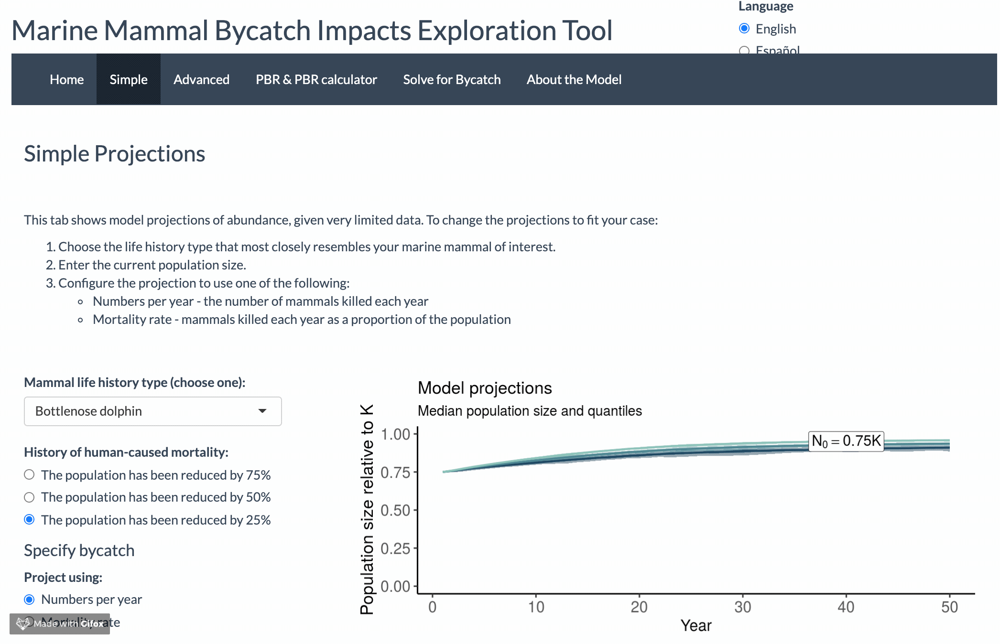
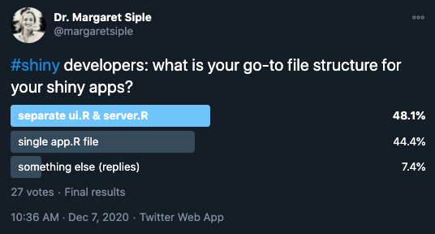
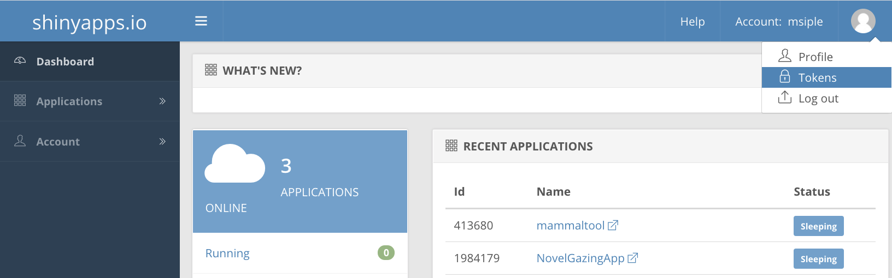

class: center, middle

# Hello! 

---

class: center, middle


---

# Marine science is like an orchestra

Each musician has areas where they’re very specialized, and areas where they are clueless

--

What we do is a combination of highly technical skilled work and more whimsical multitasking/communicating

--

But we’re all working together to try to make a big, beautiful thing happen

---

class: center, middle

<sub><sup>Photo: Shaya Lyon</sup></sub>

---

class: center, middle

<sub><sup>Photo: Shaya Lyon</sup></sub>

---
# How we deal with complexity in an orchestra setting: 

### Clean it up

### Use building blocks

### Streamline our communications

### People are the special ingredient

--

## <mark>This is the same in marine science! Shiny can help us with many of these tasks.</mark>


---

class: center, middle

Shiny can be a little gnarly at first.


---

# Today's roadmap

1. `shiny` basics - when to use it, how to do it

--

2. Using `leaflet` to put interactive maps in your app
  
--

3. Building nice dashboards with `shinydashboard`

--

If you'd like to follow along, clone this directory and follow the examples!
[https://github.com/mcsiple/shinyoverview](https://github.com/mcsiple/shiny-biol551)

---


# Why I learned Shiny


.caption[
**Image:** Jeff Moore
]

---

# Why I learned Shiny



---

# What is Shiny?


---

# When is Shiny useful?

When we want to make R code accessible outside of an R or RStudio environment. For example,

--

- teaching a package

--

- showing data visualizations to non-experts

--

- streamlining certain code-intensive things (like database queries or visualizing bulky simulation outputs)

---
class:center, middle, inverse

# Shiny basics

---

# Starting a new Shiny app

Install **shiny**:

```{r eval=FALSE, tidy=FALSE}
install.packages("shiny")
```

From The RStudio IDE, pick `New File -> Shiny Web App`

You can choose between single (**app.R**) or multiple files (**ui.R** and **server.R**)

*Does it matter which one you choose?*
>Not really. Some people like the organization of having multiple files. But it really doesn't make a difference!



---

# Each Shiny app has two components

The **`ui`** (user interface) object dictates the appearance of the app. UI functions write HTML. For something to appear in your app, it needs to be in the UI.

--

***

The **`server()`** function contains rendering expressions that create the objects to display. 


The server function and UI object are passed to the `shinyApp()` function to create a Shiny app object.

---

# **ui.R**/server.R

.pull-left[
The ui looks like this:

```{r eval=FALSE}
ui <- fluidPage(
    titlePanel("Old Faithful Geyser Data"),
    sidebarLayout(
        sidebarPanel(
*            sliderInput("bins",
                        "Number of bins:",
                        min = 1,
                        max = 50,
                        value = 30)),
        mainPanel(
*           plotOutput("distPlot"))
    )
)
```
]

.pull-right[
The corresponding ui looks like this:


]

---

# **ui.R**/server.R

The ui code contains the following information: 

1. The UI type 
  - `fluidPage()` puts elements in rows that can include columns `r emo::ji("cake")`
  - `navbarPage()` has a navigation bar `r emo::ji("file")`

2. Layout elements (`sidebarLayout()` etc.)

3. Theme information (e.g., `{shinythemes}`)

--

4. Output objects (`plotOutput()`, etc.)

5. Input objects (`sliderInput()`,`fileInput()` etc.) - also called "[widgets](https://shiny.rstudio.com/gallery/widget-gallery.html)"

*Input objects link the user interface to the R code on the server.*

---

# ui.R/**server.R**

The server builds a list-like object called `output`. The contents of `output` are displayed in the ui.

```{r eval= FALSE}
server <- function(input, output) {
    output$distPlot <- renderPlot({
        # generate bins based on input$bins from ui.R
        x    <- faithful[, 2]
        bins <- seq(min(x), max(x), length.out = input$bins + 1)
        # draw the histogram with the specified number of bins
        hist(x, breaks = bins, col = 'darkgray', border = 'white')
    })
}
```

---

# **ui.R**/**server.R**

The server builds a list-like object called `output`. The contents of `output` are displayed in the ui. Here is how they are linked:

.pull-left[
```{r eval= FALSE}
server <- function(input, output) {
*    output$distPlot <- renderPlot({
        # generate bins based on input$bins from ui.R
        x    <- faithful[, 2]
        bins <- seq(min(x), max(x), length.out = input$bins + 1)
        # draw the histogram with the specified number of bins
        hist(x, breaks = bins, col = 'darkgray', border = 'white')
    })
}
```
]

.pull-right[
```{r eval=FALSE}
ui <- fluidPage(
    titlePanel("Old Faithful Geyser Data"),
    sidebarLayout(
        sidebarPanel(
            sliderInput("bins",
                        "Number of bins:",
                        min = 1,
                        max = 50,
                        value = 30)),
        mainPanel(
*           plotOutput("distPlot"))
    )
)
```
]
---

# What's on the server?

R code... mostly :)

--


---

# ui.R/**server.R**

- **Rendering functions** (`renderPlot()`, `renderTable()`, etc.)
  - Build a new object to display every time the inputs change

--

- **Reactive expressions**
  - `reactive()` caches reactive objects so you can access them later in the server logic -- very important!
  - `eventReactive()` creates reactive objects but only when a specific input changes (e.g., a "Run Analysis!" button is clicked)
  - lazy

--

- **Observe expressions** change the ui based on input, e.g.,
  - autopopulate default values in a form if a user has selected a default
  - change the range for one input based on another input
  - eager

---

class: center, middle

# 01_basics/app.R

---
class:center, middle, inverse

# Interactive maps with `leaflet`

---

# Maps in Shiny with `leaflet`

- Leaflet is an open-source JavaScript library that makes interactive maps.

- It's *very cool*! And the `leaflet` R package integrates well with Markdown files and Shiny apps so you can show spatial data.

- It gets fancy very fast. [Here](https://rstudio.github.io/leaflet/) is the guide for using `leaflet` in R and integrating it with Shiny.

---

class: center, middle

# 02_maps/app.R

---

class: center, middle, inverse

# Dashboards with `shinydashboard`

---

# Why make a dashboard?

To show a dataset several ways in one place (and automatically update it!)
Use it for:

- communicating data in a polished way

- offering access to visualizations from a database

- showing a "data story" in a linear way


---

# Making a shiny dashboard

- Shiny dashboards are just like Shiny apps, so you start them the same way you would a basic Shiny app

- In RStudio:
> File --> New File --> Shiny Web App

- Load the following packages:
```{r eval=FALSE}
library(tidyverse)
library(shiny)
library(shinydashboard)
```

- Now you're ready to make a Shiny dashboard!

---

# Anatomy of a dashboard

- a `dashboardPage` requires three components: a header, a sidebar, and a body.

--

```{r eval=FALSE}
ui <- dashboardPage(
  dashboardHeader(),
  dashboardSidebar(),
  dashboardBody()
)
```
--

- You can populate these with shiny-esque items (e.g., `PlotOutput`) or items unique to `shinydashboard`

---

# Special widgets for dashboards - sidebar and header

- Dashboards have lots of fun menus

  - Notification menus (containing `notificationItem()` s)
  
  - Task menus (containing `taskItem()` s)
  
  - Sidebar menus (containing `menuItem()`s)

---


# Special widgets for dashboards - body

- There are also some fun body contents

  - `tabBox`
  
  - `infoBox`
  
  - `valueBox`

---

class: center, middle

# 03_dashboards/app.R

---

# Important Shiny lesson: having fun and relaxing are good!


---

class: center, middle, inverse

# Some cool Shiny apps

[Beyond Temperature](https://heatherwelch.shinyapps.io/beyond_temperature/) by Jennifer McHenry, Heather Welch, Sarah E. Lester, and Vincent Saba

[tidytuesday.rocks](https://nsgrantham.shinyapps.io/tidytuesdayrocks/) by Neal Grantham

[Sentify](https://rcharlie.shinyapps.io/sentify/) by Charlie Thompson

---

class: center, middle


---

class: center, middle


---

class: center, middle

# Fin!

### contact

`r emo::ji("email")`: mcsiple@gmail.com
`r emo::ji("bird")`: @margaretsiple

### **More Shiny resources:**

[Mastering Shiny](https://mastering-shiny.org/) by Hadley Thee Wickham 

Colin Fay has several [talks](https://colinfay.me/talks-publications/) on Shiny app workflow and production

We love a [cheatsheet](https://shiny.rstudio.com/images/shiny-cheatsheet.pdf)


### Some of my Shiny apps

The [Marine Mammal Bycatch Impacts Exploration Tool](https://msiple.shinyapps.io/mammaltool/)

[Novel-gazing](https://msiple.shinyapps.io/NovelGazingApp/) (for Goodreads users) 

[Adopt Don't Shop](https://nsilbiger.shinyapps.io/AdoptDontShop/) (collaboration with Nyssa Silbiger)

***

Slides created using the R package [**xaringan**](https://github.com/yihui/xaringan).

---

# Deploying your Shiny app

## Deploy to the cloud
- Sign up for a free shinyapps.io account

- Install `{rsconnect}` 

- Configure `rsconnect` to use your account using a token from your shinyapps.io account:



---

class: center, middle, inverse

Extra slides

---

# Deploying your Shiny app

## Deploy to the cloud
- If you add a new token and click 'show', you'll get instructions for how to configure `rsconnect` 

- Configure your rsconnect installation. This will link your shinyapps.io account to your local environment:

```{r eval=FALSE}
library(rsconnect)
setAccountInfo(name="<ACCOUNT>", token="<TOKEN>", secret="<SECRET>")`
```

- You can deploy from within RStudio by clicking the 'Publish' button in the RStudio IDE, or use the console:

```{r eval=FALSE}
deployApp(server = "shinyapps.io")`
```

- woo!

---

# Deploying your Shiny app 2

## Other options for deployment

- Deploy to an RStudio Connect account (local, commercial option)

- Publish on Shiny Server (local, open source)

---

# Getting credit for your Shiny development

If you've put a lot of time into making a Shiny app, you should get credit! 
The publication/credit avenues are unconventional for Shiny apps, but they DO exist.

- Publish as a package in an open source software journal (e.g., [JOSS](https://joss.theoj.org/) ) (check out the `{golem}` pkg for structuring your files and streamlining production) `r emo::ji("package")`

- Publish code straight from GitHub with a DOI from Zenodo ( [here](https://www.rinproduction.com/en/posts/005-8-tips-for-a-production-ready-shiny-application/) are some good tips for preparing your app for production )

- (for "just for fun" apps): submit your Shiny app to the RStudio [Shiny contest](https://community.rstudio.com/t/shiny-contest-2020-is-here/51002)
<!-- see if you can get some data on citation rates for JOSS vs zenodo github entry -->